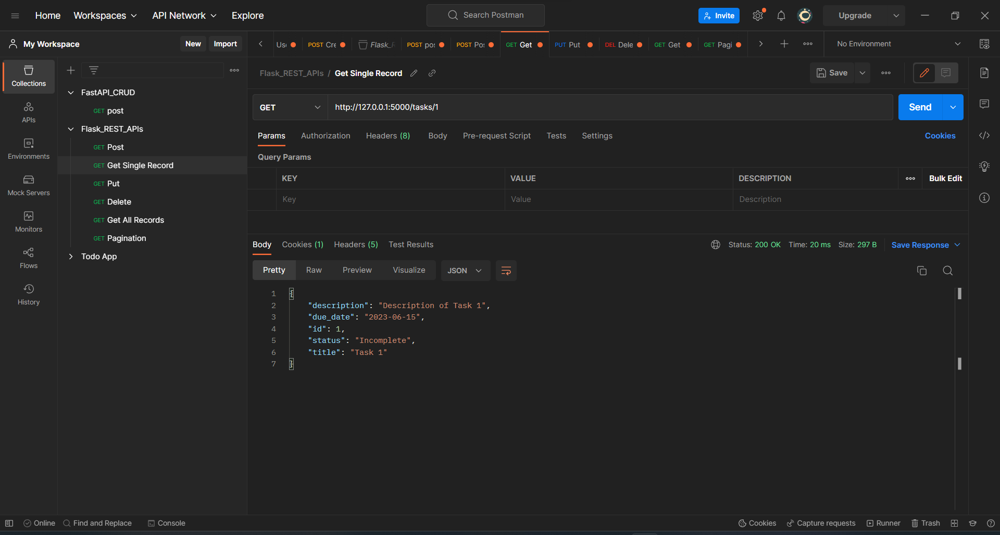

In this, I have mentioned all the steps screenshots everything, check the full document.

## Task Manager API

The Task Manager API is a RESTful API built with Python and Flask. It allows users to manage tasks by providing endpoints for creating, retrieving, updating, and deleting tasks. The API also supports pagination for listing tasks.

### Endpoints

#### Create a Task

- URL: `/tasks`
- Method: `POST`
- Default Host `http://127.0.0.1:5000/` add `/tasks` to it.
- Description: Create a new task.
- Request Body:
  - `title` (required): Title of the task (string).
  - `description`: Description of the task (string).
  - `due_date`: Due date of the task in the format "YYYY-MM-DD" (string).
  - `status`: Status of the task. Possible values: "Incomplete" (default), "In Progress", "Completed" (string).
- Response:
  - Status Code: 201 (Created)
  - Body: JSON object representing the created task.

#### Retrieve a Task

- URL: `/tasks/<task_id>` example :`http://127.0.0.1:5000/tasks/1`
- Method: `GET`
- Description: Retrieve a single task by its ID.
- Path Parameters:
  - `task_id`: ID of the task (integer).
- Response:
  - Status Code: 200 (OK)
  - Body: JSON object representing the task.

#### Update a Task

- URL: `/tasks/<task_id>` example : `http://127.0.0.1:5000/tasks/2`
- Method: `PUT`
- Description: Update an existing task.
- Path Parameters:
  - `task_id`: ID of the task (integer).
- Request Body:
  - `title`: Updated title of the task (string).
  - `description`: Updated description of the task (string).
  - `due_date`: Updated due date of the task in the format "YYYY-MM-DD" (string).
  - `status`: Updated status of the task. Possible values: "Incomplete", "In Progress", "Completed" (string).
- Response:
  - Status Code: 200 (OK)
  - Body: JSON object representing the updated task.

#### Delete a Task

- URL: `/tasks/<task_id>` example :`http://127.0.0.1:5000/tasks/8`
- Method: `DELETE`
- Description: Delete a task.
- Path Parameters:
  - `task_id`: ID of the task (integer).
- Response:
  - Status Code: 200 (OK)
  - Body: JSON object with a message indicating that the task has been deleted.

#### List all Tasks

- URL: `/tasks` example : `http://127.0.0.1:5000/tasks`
- Method: `GET`
- Description: List all tasks.
- Response:
  - Status Code: 200 (OK)
  - Body: JSON object containing the list of tasks and total item count.

#### List Tasks by Page

- URL: `/tasks/page/<page>` example : `http://127.0.0.1:5000/tasks/page/1`
- Method: `GET`
- Description: List tasks based on the specified page number.
- Path Parameters:
  - `page`: Page number (integer).
- Query Parameters:
  - `per_page`: Number of tasks per page (default: 5).
- Response:
  - Status Code: 200 (OK)
  - Body: JSON object containing the list of tasks for the specified page, current page number, total pages, and total item count.

### Data Model

The Task model has the following properties:

- `id`: ID of the task (integer, primary key).
- `title`: Title of the task (string, required).
- `description`: Description of the task (string).
- `due_date`: Due date of the task (date).
- `status`: Status of the task (string, default: "Incomplete").

### Error Handling

The API handles the following error scenarios:

- Task not found (Status Code: 404):
  - Returned when attempting to retrieve, update, or delete

 a task with an invalid or non-existing ID.

- Invalid date format (Status Code: 400):
  - Returned when providing an invalid date format for the due_date field.

### Pagination

The API supports pagination for the task list endpoint (`/tasks`). The number of tasks per page can be specified using the `per_page` query parameter. By default, each page contains 5 tasks.

The task list endpoint (`/tasks`) returns the total item count in the response, while the task list by page endpoint (`/tasks/page/<page>`) returns the current page number, total pages, and total item count.

### Running the Application

To set up and run the Task Manager API locally, follow these steps:

1. Install the required dependencies specified in the project's `requirements.txt` file. You can use the following command to install them:

   ```
   pip install -r requirements.txt
   ```
2. Create a new SQLite database file named `tasks.db`.
3. Run the application using the following command:

   ```
   python app.py
   ```
4. The API will be available at `http://localhost:5000/`. You can use tools like cURL or Postman to interact with the API endpoints. In my case, I have used Postman.

## Usage through Postman

Here are the steps to test the Task Manager API using Postman:

1. **Create a Task**

   - Open Postman and create a new request.
   - Set the request method to `POST`.
   - Set the request URL to `http://localhost:5000/tasks`.
   - Set the request body to `raw` and select `JSON` as the data type.
   - Set the Header `KEY` as `content-type` and `VALUES` as `application/json`.
   - Enter the task details in the request body. For example:
     ```json
     {
         "title": "Task 1",
         "description": "Description of Task 1",
         "due_date": "2023-06-30",
         "status": "Incomplete"
     }
     ```
   - Send the request.
   - 
2. **Retrieve a Task**

   - Create a new request in Postman.
   - Set the request method to `GET`.
   - Set the request URL to `http://localhost:5000/tasks/{task_id}`.
   - Replace `{task_id}` with the ID of the task you want to retrieve.
   - Send the request.

     
3. **Update a Task**

   - Create a new request in Postman.
   - Set the request method to `PUT`.
   - Set the request URL to `http://localhost:5000/tasks/{task_id}`.
   - Replace `{task_id}` with the ID of the task you want to update.
   - Set the request body to `raw` and select `JSON` as the data type.
   - Set the Header `KEY` as `content-type` and `VALUES` as `application/json`.
   - Enter the updated task details in the request body. For example:

     ```json
     {
         "title": "Updated Task 1",
         "description": "Updated description of Task 1",
         "due_date": "2023-07-15",
         "status": "In Progress"
     }
     ```
   - Send the request.

     
4. **Delete a Task**

   - Create a new request in Postman.
   - Set the request method to `DELETE`.
   - Set the request URL to `http://localhost:5000/tasks/{task_id}`.
   - Replace `{task_id}` with the ID of the task you want to delete.
   - Send the request.

     
5. **List all Tasks**

   - Create a new request in Postman.
   - Set the request method to `GET`.
   - Set the request URL to `http://localhost:5000/tasks`.
   - Send the request.

     

     
6. **List Tasks by Page**

   - Create a new request in Postman.
   - Set the request method to `GET`.
   - Set the request URL to `http://localhost:5000/tasks/page/{page}`.
   - Replace `{page}` with the page number you want to retrieve.
   - Optionally, add the query parameter `per_page` to specify the number of tasks per page. For example, `http://localhost:5000/tasks/page/2?per_page=10` will retrieve the second page with 10 tasks per page.
   - Send the request.
     

     

Make sure to replace `{task_id}` and `{page}` with the actual values when sending the requests.

That's it! You can now test the Task Manager API using Postman by following these steps. 


Let me know if you need further assistance!
